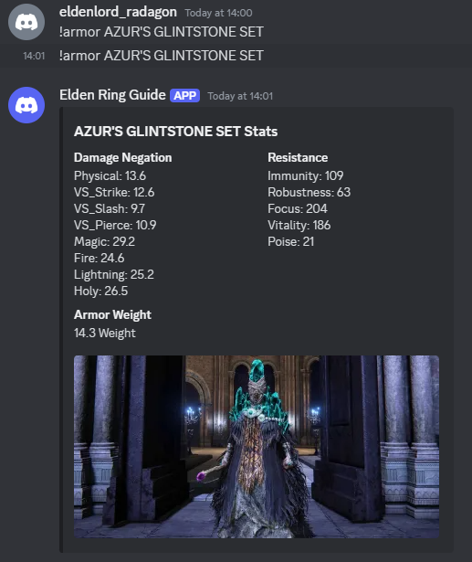

# Elden Ring Armor Stats Discord Bot

## Description

The Armor Stats Discord Bot provides detailed statistics for armor sets in a game. Users can query armor sets using commands in Discord, and the bot responds with embedded messages containing the armor stats.

## Features

- Fetch armor set details by name.
- Display armor stats including damage negation, resistance, and weight.
- Provide embedded responses with armor images.
- Refresh image cache using a timestamp.
- Display bot command instructions as its status.

## Prerequisites

- Python 3.6 or higher
- `discord.py` library
- JSON configuration file for the Discord token
- Armor data stored in a JSON file

## Installation

1. **Clone the repository:**
    ```sh
    git clone https://github.com/yourusername/armor-stats-bot.git
    cd armor-stats-bot
    ```

2. **Install required packages:**
    ```sh
    pip install discord.py
    ```

3. **Set up your configuration:**
    Create a `config.json` file in the project directory with your Discord bot token:
    ```json
    {
        "DISCORD_TOKEN": "YOUR_DISCORD_BOT_TOKEN"
    }
    ```

4. **Prepare your armor data:**
    Ensure you have an `armor_sets_data.json` file in the project directory containing the armor stats. Here is a sample structure:
    ```json
    [
        {
            "Armor_Name": "AZUR'S GLINTSTONE SET",
            "Armor_Image": "https://static1.thegamerimages.com/wordpress/wp-content/uploads/2023/03/azur-s-glintstone-set-in-elden-ring.jpg",
            "Damage_Negation": {
                "Physical": 13.6,
                "VS_Strike": 12.6,
                "VS_Slash": 9.7,
                "VS_Pierce": 10.9,
                "Magic": 29.2,
                "Fire": 24.6,
                "Lightning": 25.2,
                "Holy": 26.5
            },
            "Resistance": {
                "Immunity": 109,
                "Robustness": 63,
                "Focus": 204,
                "Vitality": 186
            },
            "Armor_Weight": 14.3
        }
    ]
    ```

## Usage

1. **Run the bot:**
    ```sh
    armor.py
    ```

2. **Invite the bot to your server:**
    Follow Discord's instructions to invite your bot using its client ID.

3. **Use the command in Discord:**
    - Query an armor set: `!armor <armor_name>`

## Bot Status

Once the bot is online, it will display the status: `Type !armor <name> for armor stats`.

## Example

In a Discord channel, type:
!armor AZUR'S GLINTSTONE SET

The bot will respond with an embedded message containing the armor stats and an image.

## Screenshots

Here is an example of the bot in action:



## Contributing

Contributions are welcome! Please fork the repository and create a pull request with your changes.

## Contact

For any questions or suggestions, please open an issue on GitHub or contact me via:

- **Email:** [adityas182107@gmail.com](adityas182107@gmail.com)
- **LinkedIn:** [Aditya Sanap](https://www.linkedin.com/in/aditya-sanap-ams1821/)
- **GitHub:** [AdityaSanap1821](https://github.com/AdityaSanap1821)
